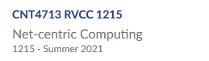
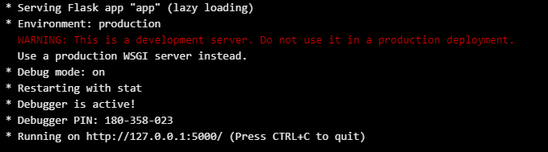

#	CNT 4713 Net-Centric Computing Class Project
<p align="center">

</p>

This is a simple web application where I am hosting a static & live feed.
Pretty much you'll see a video of me back from 2006 when my band tried our luck at a Battle of the Bands.
I'm also live-streaming from my webcam using openCV & Ngrok.

The website is <a href="https://newappv.herokuapp.com">here</a>.

I used for this project the following:
<ul>
	<li>Python</li>
	<li>Ananconda</li>
	<li>Flask Framework</li>
	<li>OAuth: Google</li>
	<li>OpenCV</li>
	<li>Ngrok</li>
	<li>Heroku</li>
</ul>

While developing this application, I had to learn Python fundamentals and
Web Development using the Flask Framework.

<h2>Recommended Courses & Tutorials:</h2>

<a href="https://www.udemy.com/share/1013nI2@FG5gV2FbSF0Kck5EBHBnVBRu/">Udemy: Python and Flask Bootcamp: Create Websites using Flask!</a>
<br>
<a href="https://www.udemy.com/share/101Wai2@Pm1gbFlSTlQGdUBAEmJOVD1HYA==/">Udemy: Learn Python Programming Masterclass</a>
<br>
<a href="https://manivannan-ai.medium.com/live-webcam-flask-opencv-python-26a61fee831">Live Webcam Flask Opencv Python</a>

#	Set-up

<h6>Please note that this is not the best solution but most of these concepts were alien to me at the start of the project.</h6>

<h2>Step 1: Download Project & Set-Up Your Python Environment</h2>
<br>

To download the project:

```
git clone https://github.com/Markojudas/CNT4713-Class_Project.git
```

Download and install <a href="https://www.anaconda.com/">Ananconda</a>

After you download and install Ananconda, create a Python environement. Open your command prompt (Windows Key + r -> cmd)
and type the following: (you can replace "webstream" by whatever you wish)

```
conda create -n webstream flask
```

This will start creating the environment and install the <a href="https://flask-doc.readthedocs.io/en/latest/"> Flask Framework </a>.
It will ask for your input to install other dependencies; enter 'y' to proceed. Once it finishes creating the environment it will show
you how to activate (and deactivate) the environment. Type the command:

```
conda activate webstream
```

<h2>Step 2: Download the requirements</h2>

All the dependencies needed for this all to work are on the requirements.txt file. To install them, through your command prompt, you have to change to the directory
where you downloaded this project (the root directory of project).

Note: Please make sure you have activated the environment

```
cd <path to project>
```

then type the following command:

```
pip install -r requirements.txt
```

This will install everything.


<h2>Step 3: Set-up the Flask_Dance to Connect the Google OAuth Client</h2>

if you wish to learn more about Flask Dance, you can always read the <a href="https://flask-dance.readthedocs.io/en/latest/">docs</a>
<br>
The code is already implemented but you'll have to create your own client_id and client_secret. Please visit <a href="https://github.com/singingwolfboy/flask-dance-google">Google OAuth Client</a>
for more information on how to do so.

Once you have created a new Client ID through Google, set the environment variables by creating a file in your app root directory and name it '.env'

```
CLIENT_ID=
CLIENT_SECRET=
RELAX_TOKEN=True
```
Set the CLIENT_ID & CLIENT_SECRET by copying and pasting the strings given by Google.

# Run Locally

At this point the application should be able to run locally. (make sure you have activated the environment):

Before launching the application locally you have to uncomment lines 3 and 4 from the "app.py" file. This will allow you to use the Google OAuth Client with HTTP and HTTPS.
This is only for testing your application locally. When ready to deploy, please comment those lines again. Go back to your Google OAuth Client to authorized your localhost.

Click on your Web Client and under "Authorized redirect URIs" add the following: "http://127.0.0.1:5000/login/google/authorized".

Windows:
```
python app.py
```

Linux/macOS:
```
python3 app.py
```

Output:
<p align="center">

</p>

Open your preferred browser and go to the URL from your output. Please note that the live feed will not work. Close your application (Ctrl + C) and follow the next step.

# Webcam Server & live_feed.html

Open a cmd/terminal and change to the project directory. Run the following command to run webcamserver.py

```
python webcamserver.py
```
Please note this implementation requires a basic paid subscription to <a href="https://ngrok.com/">NGROK</a>. Download NGROK and connect your account by opening a second cmd/terminal
and changing to the directory where you downloaded NGROK and following the instructions provided. If you have a paid subscription you have the ability to create and use up to 3 domain names instead
of the dynamic address provided by NGROK. (keep webcamserver.py running)

<strong>Dynamic Address (free account):</strong>
<br>Windows Command:
```
ngrok http 8888
```
Linux/macOS
```
./ngrok http 8888
```
This will give you two addresses (http and https) to access your localhost outside your network (each time you run NGROK it will be a different string). It will look like this:

```
http://randomstring.ngrok.io
https://samerandomstring.ngrok.io
```

<strong>Reserved Domain:</strong>
<br>Windows Command:
```
ngrok http --region=us --hostname=YOURDOMAINNAME.ngrok.io 8888
```
Linux/macOS:
```
./ngrok http --region=us --hostname=YOURDOMAINNAME.ngrok.io 8888
```

Keep NGROK running and open the "live_feed.html" file. Replace the img src with the address provided by NGROK.
```
line 8 
```

At this point everything is set up to run locally. Run "app.py" again! (again, make sure both NGROK and webcamserver.py are still running as well)

# Deploy to Heroku

Before starting this process make sure to copy the contents of ".gitignore" on a text file because you will need it if you wish to publish your code.
Delete the file from your root directory.

Visit <a href="https://id.heroku.com/login">Heroku</a> and create an account if you don't already have one. Once on your dashboard, Create new app.
After creating the app your URL will be in the following format: "https://YOURNAMEDAPP.herokuapp.com". At this point you need to authorized this URL access to Google OAuth.
Go back to your Google Web Client and under "Authorized redirect URIs" add the following:"https://YOURNAMEDAPP.herokuapp.com/login/google/authorized"

You'll need to download and install <a href="https://git-scm.com/downloads">Git</a>. Close your text editor and/or cmd/terminal. Now, you'll need to also download and install <a href="https://devcenter.heroku.com/articles/heroku-cli">Heroku CLI</a>. Re-open your text editor and/or cmd/terminal and follow the instructions shown on your Heroku App/Deploy tab.

Your Application now should be up and running; you will have to run wecamserver.py & NGROK for the live_feed to work.
